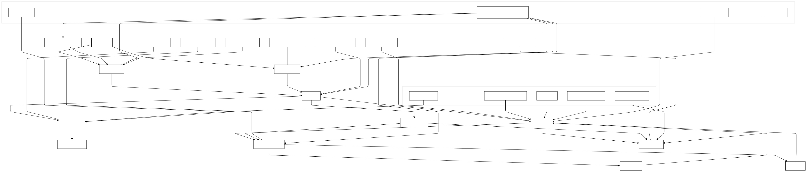

# Bloopa 🌈🐾

## Overview 📚✨
Welcome to **Bloopa**, the innovative app designed to empower children with speech difficulties! Bloopa transforms learning and communication through interactive features that engage kids in fun and meaningful ways. 🌟 

- **Multi-modal Input**: Engage through speech, touch, or gestures 🎤🤚
- **AI-Powered Support**: Friendly virtual bots help develop communication skills 🤖❤️
- **Visual Learning**: Avatars like mothers and Santa Claus teach abstract concepts 🌟🎅
- **Speech Restoration**: Advanced speech recognition enhances communication abilities 🔊🗣️

## Architecture 📚✨

  
  

## Videos 📚✨
  
  
  

